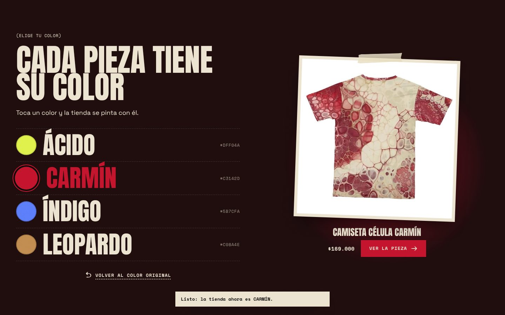

# Hight 2.0 — tema de Shopify

Tema Online Store 2.0 para **hight18.myshopify.com**. La versión 2.0 cambia la tienda por completo: colores,
tipografías y orden de las secciones salen de las prendas (denim intervenido, patchwork, tintes ácidos, malla) y
la página se volvió interactiva: las fotos se arrastran, las cintas de texto aceleran con el scroll, el visitante
elige el color de la tienda y cada pieza tiene su anatomía explicada punto por punto.


> Las capturas de `docs/preview/` se hicieron renderizando el Liquid del tema con las prendas reales de la tienda.
> La foto de la Chaqueta blood rose es un reemplazo de la vista previa: en la tienda se ve la foto real.

## Qué cambió

| | Hight 1.0 | Hight 2.0 |
| --- | --- | --- |
| Colores | Plata cepillada y aura (azul) | **Carbón** y **hueso** de base; **ácido** (Jean Dragón), **carmín** (Camiseta Célula), **índigo** (Jean Wide) y **leopardo** como acentos y fondos de sección |
| Tipografías | Archivo, IBM Plex Mono, Instrument Serif, Hight Espina | **Anton** (titulares gigantes), **Space Grotesk** (texto) y **Space Mono** (marquillas, precios, botones) |
| Motivos | Metal, cianotipo, halo | Fotos como copias impresas con cinta, costuras punteadas, grano de fotocopia y sellos que giran |
| Home | Hero, catálogo, spread, manifiesto | Hero collage → cinta → fila de piezas → Elige tu color → video de campaña → Anatomía de una pieza → Archivo → Lookbook → Manifiesto |

El logo gótico se mantiene: es la marca. El design system original sigue en [`design-system/`](design-system/README.md) como referencia.

## Lo interactivo

- **Hero collage:** el logo al centro y las prendas como fotos pegadas con cinta. En computador se arrastran y se
  mueven con el cursor; en el teléfono flotan. El botón **MEZCLAR** las reparte de nuevo.
- **Cintas de texto:** corren de lado a lado y aceleran cuando haces scroll.
- **Fila de piezas:** se arrastra con el mouse, tiene flechas y barra de avance. Las tarjetas se inclinan con el
  cursor y dejan **AGREGAR** al carrito sin entrar a la ficha (o elegir talla, en la camiseta).
- **Elige tu color:** cada color lleva a una prenda. Al tocarlo, **toda la tienda se pinta** con ese acento y el
  navegador lo recuerda. Se puede volver al color original.
- **Anatomía de una pieza:** puntos numerados sobre el Jean Flare Patchwork Leopardo; cada uno abre su detalle.
- **Archivo:** lista con nombres gigantes; en computador la foto de cada pieza sigue al cursor.
- **Manifiesto:** el texto se enciende palabra por palabra con el scroll.
- **Menú a pantalla completa** con foto al pasar por cada enlace, **zoom** de fotos en la ficha, **barra fija para
  comprar** en el teléfono, selector de **columnas** en la tienda, etiqueta junto al cursor (VER, ARRASTRA) y
  transición suave entre páginas.

Todo respeta la opción de reducir movimiento del teléfono o del computador, y se puede apagar en
*Configuración del tema > Movimiento*.



## Fotos y videos de Higgsfield

El tema tiene tres lugares listos para el material de campaña (por ejemplo, el que generes en Higgsfield):

1. **Hero collage > Fondo:** un video en bucle detrás del logo y las fotos.
2. **Video de campaña:** sección a pantalla completa con titular y botón. Sin video no aparece en la tienda.
3. **Lookbook:** hasta 6 fotos pegadas como en un fanzine. Sin fotos no aparece en la tienda.

Sube el archivo en *Contenido > Archivos* o directamente en el campo de la sección, desde *Personalizar*.

## Configurar la tienda

1. **Color de cada prenda:** metacampo de producto `custom.acento` (tipo color). La ficha, la tarjeta y el botón
   de compra usan ese color. Sin metacampo se usa el acento del tema.
2. **Menús:** `main-menu` (se abre a pantalla completa; de 3 a 6 enlaces) y `footer`.
3. **Precio:** *Configuración > Tienda > Moneda > Cambiar formato*: `${{amount_no_decimals_with_comma_separator}}` → `$690.000`.
4. **Piezas únicas:** una prenda con una sola variante e inventario de 1 unidad muestra **PIEZA ÚNICA** y el sello que gira.
5. **Envío gratis:** el aviso del carrito está apagado (0). Actívalo en *Configuración del tema > Carrito* solo si lo ofreces.
6. **Metacampos opcionales:** `custom.corte_material` (tipo en la tarjeta), `custom.ficha` (ficha técnica),
   `custom.nota_corte` y `custom.guia_tallas` (`camiseta`, `hoodie` o `pantalon`).

## Publicar con Shopify CLI

```bash
npm install -g @shopify/cli@4.9.0
git clone https://github.com/yhdc86dgnb-afk/HIGHT.git && cd HIGHT
git checkout claude/shopify-hight-design-system-1nh69f

shopify theme check                                      # validar
shopify theme dev --store hight18.myshopify.com          # vista previa con los datos reales
shopify theme push --store hight18.myshopify.com --unpublished --theme "Hight 2.0"
```

Con el entorno de `shopify.theme.toml`: `shopify theme dev -e hight` y `shopify theme push -e hight --unpublished`.
Cuando el tema esté revisado, se publica desde **Tienda online > Temas > Hight 2.0 > Publicar**.

## Estructura

```
assets/          hight.css, hight.js, fuentes (Anton, Space Grotesk, Space Mono), logos y grano
config/          settings_schema.json (acento, 5 esquemas, movimiento) y settings_data.json
layout/          theme.liquid y password.liquid
locales/         es.default.json
sections/        hero-collage, marquee, featured-collection, color-story, hotspots, index-list,
                 manifesto, video-campaign, editorial-spread (lookbook), titular, header, footer…
snippets/        product-card, sticker, product-gallery, density-toggle, price, icon…
templates/       plantillas JSON + gift_card.liquid
design-system/   design system HIGHT original (referencia)
docs/preview/    capturas de la vista previa
```

`shopify theme check` pasa sin observaciones y el workflow `.github/workflows/theme-check.yml` lo corre en cada push.

Las fuentes Anton, Space Grotesk y Space Mono tienen licencia SIL Open Font License 1.1 (vía Fontsource).
