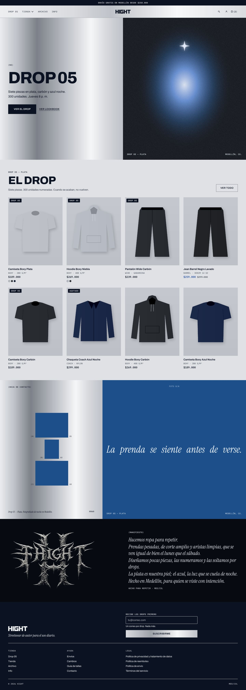

# Hight — tema de Shopify

Tema Online Store 2.0 para **hight18.myshopify.com**, construido desde cero con el design system **HIGHT**
(plata cepillada, cianotipo y aura; Archivo, IBM Plex Mono, Instrument Serif y la gótica propia Hight Espina).
Se trabaja y se publica con **Shopify CLI**.



> Las capturas de `docs/preview/` se hicieron renderizando el Liquid del tema con datos de ejemplo
> (prendas y precios del manual de marca, siluetas en lugar de fotos). En la tienda se verán tus productos reales.

## Publicar el tema con Shopify CLI

```bash
# 1. Instalar la CLI (Node 20 o superior)
npm install -g @shopify/cli@4.9.0

# 2. Clonar este repositorio
git clone https://github.com/yhdc86dgnb-afk/HIGHT.git && cd HIGHT
git checkout claude/shopify-hight-design-system-1nh69f

# 3. Validar
shopify theme check

# 4. Ver el tema con los datos reales de la tienda, sin publicarlo (abre un enlace de vista previa)
shopify theme dev --store hight18.myshopify.com

# 5. Subirlo como tema NO publicado (la tienda en vivo no cambia)
shopify theme push --store hight18.myshopify.com --unpublished --theme "Hight"
```

La primera vez, la CLI pide iniciar sesión: muestra un código y un enlace de `accounts.shopify.com` para aprobar el
acceso con tu cuenta de Shopify. Cuando el tema esté revisado, se publica desde **Tienda online > Temas > Hight > Publicar**.

Con el entorno de `shopify.theme.toml` los comandos son más cortos: `shopify theme dev -e hight` y
`shopify theme push -e hight --unpublished`. También hay atajos en `package.json` (`npm run dev`, `npm run push`, `npm run check`).

**Alternativa sin CLI:** en el admin, **Tienda online > Temas > Agregar tema > Conectar desde GitHub**, elige este
repositorio y la rama `claude/shopify-hight-design-system-1nh69f`. El tema está en la raíz del repositorio, como lo pide la integración.

## Qué trae

| Página | Secciones |
| --- | --- |
| Home (`index.json`) | Barra de anuncio · Header con plata cepillada · Hero del drop · Catálogo del drop · Spread editorial (hoja de contacto + cita en cianotipo) · Manifiesto con el logo principal · Footer |
| Producto (`product.json`) | Galería 4:5 con contador `01 / 03` · marquilla del drop en aura · precio mono · ficha técnica · color (muestras) y talla (agotadas tachadas) · guía de tallas en modal · AGREGAR AL CARRITO · aviso "Quedan N unidades" · acordeones con íconos de cuidado · recomendados |
| Colección (`collection.json`) | Título display, conteo "(8) PIEZAS", filtros nativos en drawer, orden, retícula 2/3/4 columnas, paginación `01 02 →` |
| Archivo (`list-collections.json`) | Índice numerado `(N1)` con título en serif itálica, piezas y año |
| Carrito | Carrito lateral (Section Rendering API) con aviso de envío gratis en pesos y página de carrito |
| Info (`page.info.json`) | Manifiesto + índice de drops + titular en Hight Espina con halo aura |
| Contacto (`page.contact.json`), búsqueda, blog, artículo, 404, contraseña ("Próximo drop") y tarjeta de regalo | |

Secciones que se pueden agregar desde el editor: Hero del drop, Catálogo del drop, Spread editorial, Índice de drops,
Titular Espina, Manifiesto, Foto con texto, Texto y Formulario de contacto.

## Cómo se aplicó el design system

- **Colores** → dos esquemas del editor con los tokens exactos: *Esquema 1 = Plata* (claro, por defecto) y *Esquema 2 = Aura* (oscuro).
  Cada sección elige su esquema; los tokens fijos (`silver-*`, `prussian`, `on-photo`, `on-metal`, tintas de estampado) viven en `assets/hight.css`.
- **Metal** → `.hi-metal` y `.hi-metal-soft` (plata cepillada) en header de la home, hero, pliego editorial, manifiesto y contraseña.
- **Tipografía** → Archivo, IBM Plex Mono e Instrument Serif alojadas en el tema (`assets/*.woff2`) y Hight Espina / Hueso (`assets/hight-espina*.woff`).
- **Íconos** → los 43 íconos Espina del sistema en `snippets/icon.liquid` (``; también aceptan los alias en español).
- **Componentes** → Button, Tag, Price, SizeSelector, ColorSelector, ProductCard, ProductGallery, SizeGuide, CartDrawer, CartLine,
  QuantityStepper, Accordion, Notice, Field, Header, Footer, AnnouncementBar, EditorialSpread, ContactSheet, IndexList y Titular,
  con las mismas clases `hi-*` del bundle del sistema.
- **Voz** → todos los textos de la tienda están en `locales/es.default.json`: tuteo, frases cortas, botones en infinitivo y en MAYÚSCULAS.
- La copia de referencia del sistema está en [`design-system/`](design-system/README.md).

## Configurar la tienda para sacarle todo al tema

1. **Formato de precio (COP sin decimales):** *Configuración > Tienda > Moneda > Cambiar formato*: `${{amount_no_decimals_with_comma_separator}}` → `$189.000`.
2. **Menús:** `main-menu` con Drop, Tienda, Archivo e Info (máximo 5) y `footer` con Envíos, Cambios, Guía de tallas y Contacto.
   En la columna Legal del footer incluye "Tratamiento de datos" (Ley 1581).
3. **Opciones de producto:** llámalas `Color` y `Talla`. Color se muestra con muestras circulares (usa las muestras de Shopify o
   la lista de *Configuración del tema > Productos > Colores de las muestras*); Talla, como botones.
4. **Drops:** etiqueta los productos con `DROP 05` (el prefijo se cambia en la configuración del tema).
5. **Metacampos de producto opcionales** (*Configuración > Datos personalizados > Productos*):
   | Metacampo | Tipo | Uso |
   | --- | --- | --- |
   | `custom.corte_material` | Texto de una línea | "Boxy · 280 g/m²" en las tarjetas |
   | `custom.ficha` | Texto de una línea | "100% ALGODÓN · 280 G/M² · CORTE BOXY" en la ficha |
   | `custom.nota_corte` | Texto de una línea | Nota bajo las tallas |
   | `custom.guia_tallas` | Texto de una línea | `camiseta`, `hoodie` o `pantalon` (si no, se deduce del tipo de producto) |
6. **Filtros:** instala *Search & Discovery* y agrega Color, Talla y Precio.
7. **Páginas:** crea "Info" con la plantilla `page.info` y "Contacto" con `page.contact`.
8. **Fotos:** sube la foto de campaña del drop en *Personalizar > Hero del drop* y las tomas del lookbook en *Spread editorial*.

## Pendientes del design system

- Las tablas de tallas (`snippets/size-guide.liquid`) son las medidas de referencia del manual: cámbialas por las del patronaje real
  o usa una página propia en *Ficha de producto > Página con la guía de tallas*.
- Fotos reales de producto (4:5, mismo fondo), editorial y campaña.
- Redibujar el logo principal en vector (hoy es una imagen de 977 px).

## Estructura

```
assets/          hight.css (tokens + componentes), hight.js, fuentes, logos e imágenes de campaña
config/          settings_schema.json (esquemas Plata/Aura, carrito, redes) y settings_data.json
layout/          theme.liquid y password.liquid
locales/         es.default.json
sections/        secciones y grupos de header/footer
snippets/        icon, product-card, price, variant-picker, size-guide, cart-line, facets…
templates/       plantillas JSON + gift_card.liquid
design-system/   copia del design system HIGHT (tokens, manual, componentes, fuentes, logos)
docs/preview/    capturas de la vista previa
```

`shopify theme check` pasa sin observaciones y el workflow `.github/workflows/theme-check.yml` lo corre en cada push.
