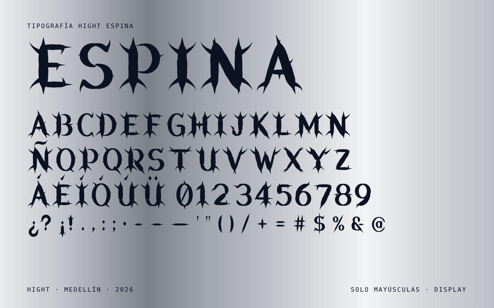
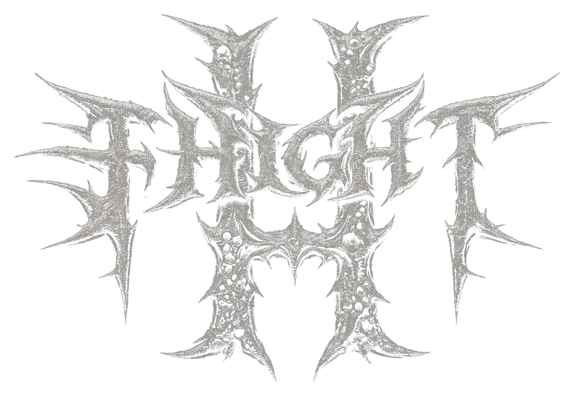

> Copia de referencia del design system **Hight** (artifact de Claude: https://claude.ai/artifact/QsjvifS9dsprctW9pJxtEJ), traída el 2026-10-08. El tema de Shopify de este repositorio lo aplica en `assets/`, `snippets/` y `sections/`. Las secciones del manual están en `secciones/`.

Hight es streetwear de autor para el uso diario. Vive entre la cultura urbana y el e-commerce, y le habla a quien busca identidad, calidad y prendas que se repiten en el armario, frente al fast fashion genérico y frente al streetwear local sin coherencia. Este sistema existe para que cada pieza (tienda, redes, empaque, campaña) se vea y suene como la misma marca mientras pasa de ventas puntuales a una comunidad reconocible.

La estética sale de dos mundos que conviven: **arquitectura** (hormigón visto, policarbonato translúcido, andamios, patios con un solo árbol, callejones de noche iluminados por una sola luz azul) y **sastrería urbana** (siluetas boxy y oversized, pantalón ancho que barre el suelo, denim negro lavado, abrigos grises, un solo destello azul eléctrico en una prenda o una luz). Sobrio, pesado, con aire. Un color fuerte, nunca dos.

El color dominante es la **plata brillante**: metal cepillado con bandas verticales de luz y sombra, como una lámina de aluminio bajo un foco. La plata es la piel de la marca (fondos, empaque, etiquetas, logo). Debajo vive el **cianotipo y el aura**: azul de Prusia, negro azulado, cuerpos que emiten luz y halos, que aparecen como luz y acento, nunca como fondo dominante.

A eso se suma una tercera capa, la **editorial**: blanco y negro de revista de moda, serif itálica que respira entre palabras, hojas de contacto numeradas, índices de trabajo entre paréntesis y gráfica de prenda que se rompe, se repite y brilla como cromo. La tienda es sobria; la campaña y la camiseta pueden ser expresivas. Ver las secciones **Dirección editorial** y **Gráfica de prenda**. Las demás secciones cubren marca, fotografía, tallas, empaque, piezas digitales y cómo se mantiene este sistema.

## Principios

1. **Estructura antes que adorno.** Retícula visible, aristas vivas, bloques planos. Si un elemento no sostiene nada, se quita.
2. **Plata primero.** Cada pieza arranca en plata (`surface-*` del tema Plata, `silver-*` o `.hi-metal`). El negro azulado es la tinta; el azul es la luz.
3. **Un acento por vista.** `aura` aparece una vez: el drop, la edición limitada o el CTA de campaña. Todo lo demás es noche, tinta y bruma.
4. **La prenda es la protagonista.** La interfaz retrocede: fondos `surface-000`, texto `ink`, fotos grandes a `ratio-product`.
5. **Precisión de marquilla.** Los datos del producto (gramaje, composición, medidas) se escriben como en una etiqueta textil: `label` y `spec` en mono, MAYÚSCULAS, sin adjetivos.

## Voz y contenido

- Habla de **tú** (tuteo latinoamericano). Nunca "usted", nunca "vos".
- Frases cortas, declarativas, en presente. Primero el dato, después la emoción: "Algodón de 280 g/m². Cae recto desde el primer uso."
- Tipo oración en titulares de producto y cuerpo ("Camiseta Boxy Concreto"). MAYÚSCULAS solo en `display-*`, `button`, `label` y `spec`.
- Nada de emojis, signos de exclamación dobles ni "¡No te lo pierdas!". La escasez se dice con datos: "Quedan 12 unidades", "DROP 05 — 300 PIEZAS".
- Precios en pesos colombianos con punto de miles y sin decimales: **$189.000**. Medidas en cm, gramaje en g/m².
- Nombra las prendas por corte + material/color: "Pantalón Wide Carbón", "Hoodie Boxy Niebla", "Jean Barrel Negro Lavado".
- Botones con verbo en infinitivo: "AGREGAR AL CARRITO", "VER GUÍA DE TALLAS", "FINALIZAR COMPRA".
- Errores: qué pasó y cómo arreglarlo, sin disculpas. "La tarjeta fue rechazada. Revisa la fecha de vencimiento o usa PSE."

### Numeración de drops

- Cada lanzamiento es un **DROP** con número consecutivo de dos cifras y una palabra de material o color: **DROP 05 — PLATA**.
- El mismo número se usa en todas partes: `(N5)` en índices y hang tags, "Drop 05 — Plata" en tipo oración dentro de texto, `DROP 05` en display.
- Con año cuando se archiva: "Drop 05 — Plata · 2026". Las prendas de línea (que no son de un drop) no llevan número.
- Los ejemplos de este sistema usan el Drop 05; cámbialo por el número real del próximo lanzamiento.

Ejemplos de copy:

> DROP 05 — PLATA
> Siete piezas en plata, carbón y azul noche. 300 unidades. Jueves 8 p. m.

> Corte boxy: hombro caído, largo corto. Si quieres más holgura, sube una talla.

## Color

Dos temas: **Plata** (claro, por defecto: metal cepillado) y **Aura** (oscuro: plata clara sobre noche azul). Úsalos siempre por token, nunca por hex.

- Fondo de página `surface-000`; drawers, modales y campos `surface-100`; foto cargando y bloques técnicos `surface-200`.
- Texto `ink` sobre cualquier superficie; secundario `ink-muted`. Rellenos `ink` llevan texto `on-ink`.
- Escala `silver-050` … `silver-700`: el material. Úsala para degradados cepillados, empaque y gráfica; `.hi-metal` y `.hi-metal-soft` ya traen el cepillado armado. Texto sobre metal siempre en `on-metal`, que no cambia de tema (≥4,7:1 incluso en la banda `silver-500`).
- El metal es la única excepción a "sin degradados": un degradado horizontal de plata que imita el cepillado. Nunca degradados de color.
- `aura` es el halo: un solo uso por pantalla. Texto sobre `aura` en `on-aura`.
- `cyan` y `haze` son colores de colección y campaña (bloques, fondos de lookbook). `haze` nunca se usa como texto. `cyan` no acompaña a `aura` en la misma vista.
- `prussian` es el azul de cianotipo de las fotos editoriales; el texto encima va en `on-photo`.
- `glow-aura` es la única luz permitida en pantalla: halo alrededor de `display-xl` o de una figura en campaña, nunca en la interfaz de compra.
- `print-glow`, `print-cyanotype` y `print-chrome-*` son tintas de estampado: viven en la prenda y en su mockup, nunca en la interfaz.
- Separadores con `line` a `border-hairline`; bordes de controles con `line-strong` a `border-control`.
- Estados (`success`, `warning`, `danger`) siempre acompañados de palabra o ícono. `danger` es coral cálido, lo único cálido de la paleta, así que no se confunde con los azules; `success` es verde agua y se distingue por luminosidad y palabra.
- Todo texto cumple 4,5:1 sobre las superficies que nombra su token, en ambos temas.

## Tipografía

Cuatro familias. **Hight Espina** es propia: la tipografía gótica de espinas dibujada a partir del logo, que viene en este sistema como archivo (carpeta `fonts/`). Las otras tres son de Google Fonts: **Archivo** (display y texto), **IBM Plex Mono** (marquillas, specs y precios) e **Instrument Serif** itálica (voz editorial).

### Hight Espina

- Mayúsculas góticas con la misma anatomía del logo: astas que terminan en punta, cuernos que salen hacia afuera y se curvan, púas en las esquinas y puntos en rombo. Dos versiones: **Hight Espina** (sólida) y **Hight Espina Hueso** (con los poros de hueso corroído del logo).
- Solo tiene mayúsculas: lo que escribas en minúscula sale en mayúscula. Incluye A–Z, Ñ, tildes (Á É Í Ó Ú À È Ò Ü), cifras 0–9 y la puntuación de uso común: ¿? ¡! . , : ; · - – — ' " ( ) / + = # $ % & @.
- Estilos: `espina-xl` (144px), `espina-l` (88px), `espina-m` (48px) y `hueso-xl` (160px). En la web, componente `Titular` o clases `.hi-espina` / `.hi-hueso`.
- Mínimo 48px en pantalla y 1,5 cm de alto de mayúscula en impresión. La versión Hueso, mínimo 120px o 4 cm, y solo sobre plata o negro liso.
- Dónde va: titular de campaña, portada de lookbook, número de drop, gráfica de prenda, hang tag, stickers, títulos de post y de video. Máximo 3 palabras.
- Dónde no va: botones, menús, formularios, precios, checkout, texto corrido, marquillas de datos. Ahí sigue Archivo o la mono.
- Una por pieza. No comparte vista con `display-xl` ni con el logo grande: si el logo manda, el titular va en Archivo.
- No reemplaza al logo. "HIGHT" escrito con la fuente no es el logo; el logo es el dibujo aprobado del grupo **Logos**.
- Color: `ink` sobre plata, `on-ink` sobre noche, `on-metal` sobre `.hi-metal`, o la textura plata del logo en campaña. El halo `glow-aura` solo en campaña nocturna.
- Para Illustrator, Figma, Canva o CapCut instala `fonts/HightEspina-Regular.ttf` y `fonts/HightEspinaHueso-Regular.ttf`; en la web carga los `.woff`. Los especímenes de las dos versiones están en el grupo de assets **Tipografia**.

### Archivo, Plex Mono e Instrument Serif

- `editorial-xl`, `editorial` y `caption-serif` solo en campaña, lookbook, índices de proyecto y pies de foto. Nunca en botones, formularios ni checkout.
- La serif contrasta con la mono: una cita en `editorial-xl` lleva marquillas en `label` en las esquinas, nunca otra serif.
- Archivo y la serif no compiten en la misma línea: si hay `display-*` en la vista, la serif baja a `editorial` o `caption-serif`.

- `display-xl` y `display-l` en Archivo 800, MAYÚSCULAS, tracking negativo. Uno por pantalla; nunca sobre fotos con mucho detalle.
- `heading-1` para el nombre del producto; `heading-2` y `heading-3` para bloques.
- `body` es el texto por defecto; `body-l` para introducciones; `body-s` para ayudas y legales. Líneas de máximo 60–65 caracteres.
- `label` (mono, MAYÚSCULAS, +0,08em) para categorías, eyebrows y Tag. `spec` para composición y medidas. `price` con cifras tabulares.
- Carga: `https://fonts.googleapis.com/css2?family=Archivo:wght@400;500;600;700;800&family=IBM+Plex+Mono:wght@400;500&family=Instrument+Serif:ital@0;1&display=swap`.

## Espacio y retícula

- Escala base de 4px: `space-1` … `space-24`. No hay valores intermedios.
- Página: máximo `container-max`; texto corrido máximo `reading-max`. Margen lateral `gutter-mobile` / `gutter-desktop`.
- Puntos de quiebre (móvil primero, `min-width`): `bp-sm` 480, `bp-md` 768, `bp-lg` 1024, `bp-xl` 1440. El header muestra la navegación y el catálogo pasa a 4 columnas desde `bp-lg`.
- Capas: solo `z-header`, `z-overlay`, `z-drawer`, `z-modal`, `z-toast`. Nada más lleva z-index.
- Catálogo: 2 columnas en móvil, 4 en escritorio, gap `space-6` (móvil `space-2`). Margen lateral `space-4` en móvil, `space-12` en escritorio.
- Las fotos van a sangre dentro de su columna, sin marco ni borde.
- Entre secciones: `space-12` en móvil, `space-16` en escritorio. Campañas con `display-xl` respiran `space-24`.

## Forma, bordes y sombras

- `radius-none` en todo. `radius-xs` solo en campos, select y Tag. `radius-full` solo en muestras de color y radios.
- Sin sombras, excepto `shadow-overlay` en drawers y modales.
- La profundidad se marca con cambio de superficie (`surface-000` → `surface-100`) o con hairline. El único degradado permitido es el cepillado de plata (`.hi-metal`).

## Fotografía e imagen

- Producto: fondo `surface-200` o hormigón real, luz lateral suave, sin sombras duras. Proporción `ratio-product`.
- Campaña: arquitectura brutalista, patios, policarbonato, calle de noche. Paleta en azules: virado a cianotipo, sobreexposición, halos, estrellas de cuatro puntas, desenfoque de movimiento y destellos de lente. El único color saturado es el azul eléctrico de la luz.
- Figuras como presencias: cuerpos luminosos sin rostro definido, flotando, en agua o rodeados de bruma. La silueta sigue mostrando el volumen de la prenda.
- El grano es obligatorio en campaña; en la foto de producto, no.
- Personas de cuerpo entero, siluetas que muestren el volumen del corte. Nada de poses de catálogo sonriente.
- Vertical `ratio-campaign` para redes; horizontal `ratio-editorial` para lookbook en escritorio.
- Editorial en blanco y negro con grano de película: retrato de perfil sobre gris liso, pelo o tela en movimiento que tapa el rostro, recortes de cuerpo (cuello, mano, oreja, clavícula) como texturas. El rostro no es obligatorio; la silueta y el volumen sí.
- Las tomas se presentan como hoja de contacto: `ratio-contact` y `ratio-portrait` alternados, con toma y número en mono.

## Movimiento

Corto y seco, sin rebotes ni parallax. Curva única `cubic-bezier(.2,0,0,1)`.

| Uso | Duración |
| --- | --- |
| Hover, foco, cambio de estado, toast | 160ms |
| Drawer, modal, acordeón | 240ms |
| Brillo de carga (Skeleton) | 1.400ms en bucle |
- Respeta `prefers-reduced-motion`: sin desplazamientos, solo cambio de opacidad.

## Estados y foco

- Hover: superficie un paso más oscura (`surface-200`) o subrayado en enlaces.
- Foco: anillo `focus` sólido de `border-focus` con 2px de separación, en todos los controles.
- Deshabilitado: opacidad 0,4 y cursor normal; nunca se esconde una talla agotada, se tacha.

## Iconografía

- Los íconos son los de **Google (Material Symbols)**, con sus mismos nombres y metáforas, redibujados con la estética Espina del logo: trazos que terminan en punta, púas cruzadas en las esquinas, cuernos curvos en la bolsa y el candado, y rombos en vez de puntos redondos. Relleno sólido, retícula de 24px, color heredado del texto.
- 43 íconos (componente `Icon` y grupo de assets **Iconos**):
  - Tienda: `shopping_bag`, `search`, `menu`, `person`, `favorite`, `local_shipping`, `undo`, `straighten`, `lock`, `credit_card`, `location_on`, `checkroom`.
  - Navegación: `arrow_forward`, `arrow_back`, `expand_more`, `expand_less`, `chevron_right`, `chevron_left`, `add`, `remove`, `close`, `open_in_new`, `grid_view`, `tune`, `swap_vert`, `visibility`.
  - Estados: `check`, `warning`, `info`.
  - Contenido y redes: `mail`, `chat_bubble`, `flare`, `grain`, `title`, `music_note`, `videocam`, `timer`.
  - Cuidado textil: `iron`, `local_laundry_service` y cuatro símbolos de la norma ISO 3758 que Google no tiene, dibujados igual: `lavar_frio`, `no_blanquear`, `planchar_bajo`, `no_secadora`.
- Se piden por su nombre de Google (`shopping_bag`). Los nombres en español del set anterior (`bolsa`, `buscar`, `cerrar`…) siguen funcionando como alias (`Hight.iconAliases`).
- Tamaños: 20, 24 (por defecto), 32 y 48px. A 16px solo `add`, `remove`, `close` y `expand_more`; los demás pierden las púas. En impresión, mínimo 5 mm.
- Un ícono nuevo se toma de Material Symbols (estilo Sharp) y se redibuja con las mismas reglas: puntas en los extremos, púas en las esquinas, rombos en los puntos, grosor de trazo de 2px a 24px. Nunca se mezcla con el Material original ni con sets de otras marcas.
- En marquillas y estados se prefieren glifos tipográficos en mono: `+` `—` `×` `→` `●`.
- Sin emojis en ninguna superficie de marca.

## Logotipo

El logo principal es la palabra **HIGHT** en letras góticas de espinas, con una **H** grande atravesando el centro y textura de hueso o metal corroído. Es el lado oscuro de la plata: la misma materia, pero rota y afilada. Está en el grupo de assets **Logos**. De su anatomía salen la tipografía **Hight Espina** y el dibujo de los íconos.

**Versiones**
- `hight-logo-plata.png`: textura plateada sobre transparente. Para fondos oscuros: negro, `prussian`, foto de noche, prenda negra.
- `hight-logo-tinta.png`: en `on-metal` (#0b1222) sobre transparente. Para plata, superficies claras y empaque.
- `hight-logo-original.png`: el archivo tal como se aprobó, sobre negro.

**Dónde va el logo principal**
- Campaña, portadas, hero de la web, espalda o pecho centro de la prenda, bolsa de envío, hang tag, stickers.
- Grande: mínimo 240px de ancho en pantalla y 6 cm en impresión. Por debajo las espinas se empastan y no se lee.

**Versión simple para tamaños pequeños**
Header de la web, favicon, marquilla bordada, botones e íconos de redes usan la palabra **HIGHT** de palo seco y el monograma **H** con estrella (archivos `hight-wordmark-*` y `hight-monograma-*`, componente `Logo`). Son la firma corta del mismo logo, no un segundo logo.

**Reglas**
- Área de protección: el ancho de una de las astas de la H grande, alrededor de todo el logo.
- No se deforma, no se recolorea fuera de plata o tinta, no se le pone sombra ni contorno. El halo `glow-aura` solo en campaña nocturna.
- Sobre fondos con mucho detalle (fotos con textura, patchwork), ponlo sobre un bloque liso de plata o negro.

**Pendiente**
- Hoy es una imagen de 1.024 px. Para serigrafía, bordado grande y registro en la SIC hay que redibujarlo en vector (Illustrator).
- En el redibujo, aclara la primera letra: hoy se puede leer como F o T y el conjunto como "FHIGHT".
